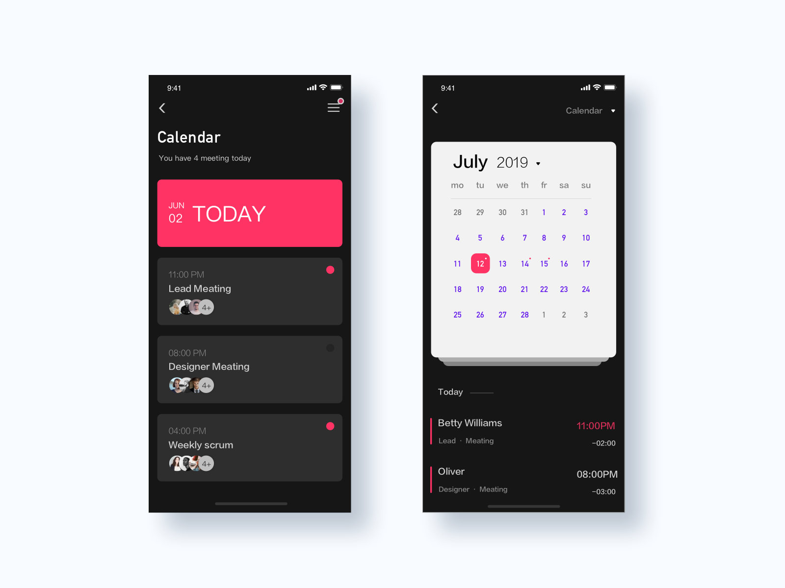
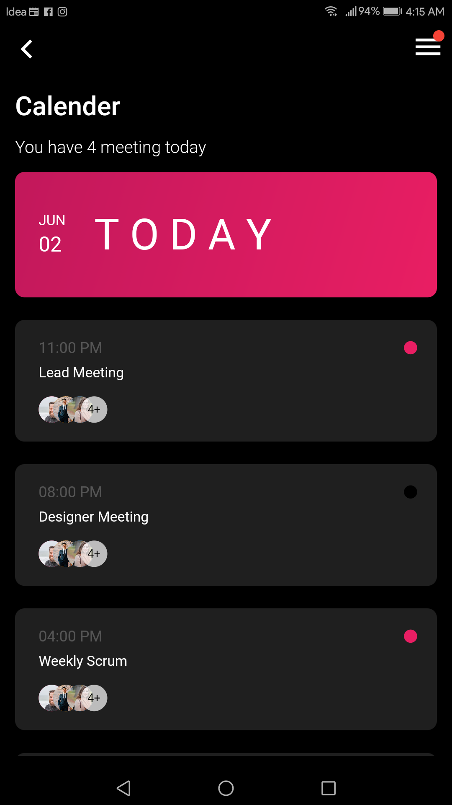

# calender_app

A new Flutter application.

## Getting Started

This project is a starting point for a Flutter application.

A few resources to get you started if this is your first Flutter project:

- [Lab: Write your first Flutter app](https://flutter.dev/docs/get-started/codelab)
- [Cookbook: Useful Flutter samples](https://flutter.dev/docs/cookbook)

For help getting started with Flutter, view our
[online documentation](https://flutter.dev/docs), which offers tutorials,
samples, guidance on mobile development, and a full API reference.

#### Concept UI

<table>
  <tr><td></td></tr>
 </table>

#### Flutter App Screenshots

<table>
  <tr>
    <td>Events Page</td>
     <td>GIF</td>
     <td>Calender Page</td>
  </tr>
  <tr>
    <td></td>
    <td></td>
    <td></td>
  </tr>
 </table>

## If you like my work and want to show some ❤️, please consider giving a ⭐️ to this Repository.
